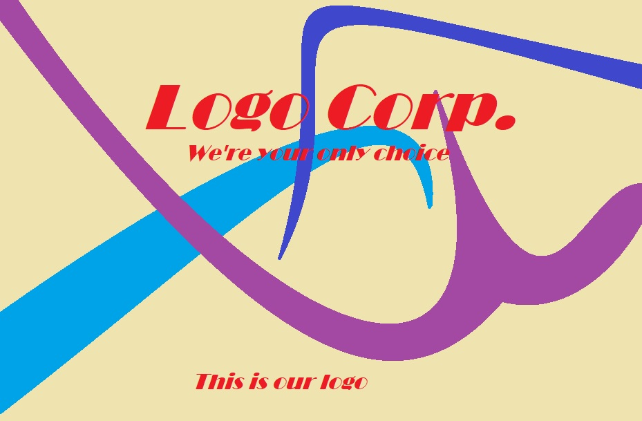

# Phase-4

Hi my name is Jacob and this is a website
## Q/A
##### What does this website do
Nothing really

##### Can I see some of the code
well sure but since you're typing this to yourself, it's kinda a strange question, I know you've seen it...

    <head>
        <title>Jaco's Jewels from Click And Drag Studios</title>
        <meta charset="UTF-8">
        <meta name="viewport" content="width=device-width, initial-scale=1.0">
        <link rel="stylesheet" href="style.css">
    </head>
    <body>
        

            

         
            

Jaco's Jewels

                                                
The hottest match 3 game out there

           
            
   
<a href="Index.html"> Home </a>

                                    
<a href="Browse.html"> Browse </a>
 
                                    
<a href="Create.html"> Create </a>
 

           
            

                
&nbsp;&nbsp;&nbsp;

                
 Welcome to the homepage of the GOTY for 16 years running!
 
                <?php include 'Showcase.php';?>
            

            
            

I'm not responsible for you're computer breaking if you use my site. Use at your own risk

        

    </body>
   
##### that looks terrible
yes I know

## Description
This website we supposed to be a showcase and tool for building levels. You should be able to see that it is not. Althoug it does have all the pages it would use. The main page would show a samll assortment of player levels, while Browse would show all of them. On the other hand Create would have a tool for players to create their own levels. That would pretty much be it.
